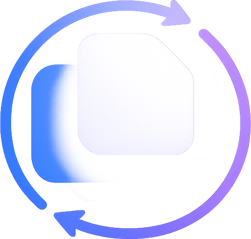

# <p align="center"><br>OpenNotes</p>

<p align="center">
  
  
  
  
  
</p>

---

**OpenNotes** is a beautiful, lightweight, and modern note-taking application designed for ultimate speed and simplicity. Inspired by high-end stationery, it features a warm "Highlighter & Sticky Note" aesthetic that makes writing feel like true paper.

---

## ✨ Key Features

### 🖋️ Stationery Design System
Experience a professional writing environment with our custom **Highlighter & Sticky Note** theme. Featuring:
- **Unique Fonts**: Using *Caveat* for handwritten headers and *Outfit* for modern body text.
- **Micro-animations**: Smooth transitions and hover effects that feel alive.
- **Dark Mode**: A beautiful "Chalkboard" dark mode for nighttime writing.

### 🔍 Powerful Search & Org
- **Live Filter**: Search through dozens of notes instantly with real-time sidebar filtering.
- **Auto-save**: Never hit save again. Every stroke is synced to the database automatically.
- **Rich Editor**: Full Tiptap integration with slash commands (`/`), task lists, and code highlighting.

### 📤 Data Portability
- **Markdown Export**: One-click download of any note as a `.md` file.
- **Markdown Import**: Drag and drop your existing Obsidian or Github notes to recreate them instantly.

### 🌐 Social Knowledge System
- **Public Notes**: Share your brilliance with the world.
- **One-Click Fork**: Found a great template? Click *Reuse* to duplicate it instantly to your workspace.

---

## 🚀 Quick Start

### 🏁 Prerequisites
- **Node.js** (v18+)
- **Python** (v3.9+)

### 🔌 1. Backend Setup
```bash
cd backend
python -m venv venv

# Windows
.\venv\Scripts\Activate
# Mac/Linux
source venv/bin/activate

pip install -r requirements.txt
uvicorn app.main:app --reload
```

### 💻 2. Frontend Setup
```bash
cd frontend
npm install
npm run dev
```
Visit `http://localhost:5173` to start writing!

---

## 🛠 Tech Stack

| Component | Technology |
| :--- | :--- |
| **Frontend** | React, Vite, TypeScript, Zustand, TanStack Query |
| **Styling** | Tailwind CSS, Lucide Icons, Google Fonts |
| **Text Engine** | TipTap Prosemirror |
| **Backend** | FastAPI, Pydantic, SQLAlchemy |
| **Database** | SQLite (Dev) / PostgreSQL (Prod) |

---

## 🤝 Contributing & License

OpenNotes is open for contributions! Feel free to open a PR.

[MIT](https://choosealicense.com/licenses/mit/) © 2026 OpenNotes.
